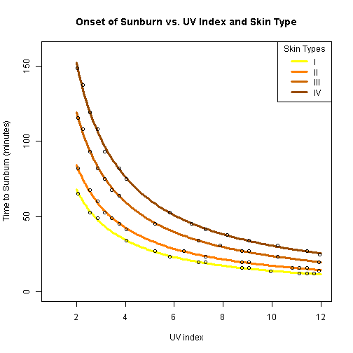
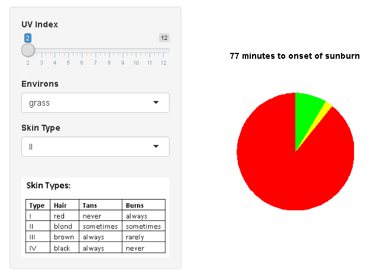

UVapp
========================================================
author: Allen Nugent
date: 28 January, 2016
  
A simple applicaton for estimating safe limits of sun exposure.

Skin Damage and Ultraviolet Radiation
========================================================

UV radiation:

- UV-A causes sunburn, deep tissue damage, skin ageing
- UV-B causes sunburn and skin cancers
- Tanning provides limited protection against sunburn _only_

What is "UV index"?

- quantifies 'net' amount of UV-A/B at Earth's surface
- figures are published by news media 
- measured by some wearables (e.g. Microsoft Band, Samsung Gear Fit S)

_Challenge:  How to use UV index to avoid sunburn?_

Sunburn vs. Skin Type
========================================================

UV Reflection from Environs 
========================================================

UA exposure is augmented by natural surfaces that reflect incident radiation

- soil: up to 10%
- grass: up to 20% (40% when wet)
- sand: up to 25%
- water: up to 50%
- snow: up to 80%

What UVapp Does
========================================================

Estimate your safe exposure limit:

  _... and don't forget the suncreen!_

